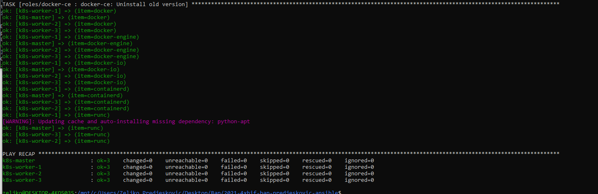

# Vagrant / Ansible / Docker swarm / K8s

## Was brauchen wir:

python 3, pip3, ansible

alles wird in der wsl gemacht:

    $python -m -venv --prompt ansible -start venv

    $. venv/bin/activate

    $pip install ansible

    $pip freeze >requirements.txt

    $pip install -r requirements.txt

venv ist das virtual environment und hilft uns mit dem requirements.txt
diese bestimmten versionen mit python zu installieren.

## Situation:

Vagrant funktioniert, jedoch keine möglichkeit die VMs mit ansible zu
steuern weil ich in der WSL nicht mit ssh zugriff haben kann. Habe einige Tage getroubleshooted und nicht wirklich eine Lösung gefunden.

## Problemlösung gefunden:

in der wsl im .ssh ordner die private.keys von den VMs kopieren und dann eine config file erstellen und das rein schreiben:

so werden die keys im ssh agent gespeichert und mann kann mit ssh auf die VMs steuern

    $ansible-playbook -i inventory -u vagrant --become playbooks/setup-docker-swarms.yml

Ansible setup mit dem command starten...

## Ergebnis:

---

### Bevor ich es mit kubernetes probiere, mach ich docker swarm. Das die files und Host namen k8s sind ist also egal xD fürs erste.

## Files:

[setup-docker-swarm.yml](playbooks/setup-docker-swarm.yml)

[roles/docker-ce/tasks/main.yml](playbooks/roles/docker-ce/tasks/main.yml)

[roles/docker-swarm-init/tasks/main.yml](playbooks/roles/docker-swarm-init/tasks/main.yml)

[roles/docker-swarm-add-worker/tasks/main.yml](playbooks/roles/docker-swarm-add-worker/tasks/main.yml)

## Ergebnis:

