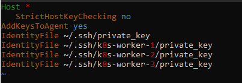

# Vagrant / Ansible / Docker swarm / K8s mit Windows

Author: Zeljko Predjeskovic

Quellen:

[Docker-swarm Setup Hilfe](https://github.com/ruanbekker/ansible-docker-swarm)

[Ansible](https://www.ansible.com/)

[Vagrant setup Hilfe](https://kubernetes.io/blog/2019/03/15/kubernetes-setup-using-ansible-and-vagrant/)

## Inhaltsverzeichnis (Bitbucket ist zu schlecht für ein Inhaltsverzeichnis)

- [Vagrant / Ansible / Docker swarm / K8s mit Windows](#vagrant--ansible--docker-swarm--k8s-mit-windows)
  - [Inhaltsverzeichnis (Bitbucket ist zu schlecht für ein Inhaltsverzeichnis)](#inhaltsverzeichnis-bitbucket-ist-zu-schlecht-für-ein-inhaltsverzeichnis)
  - [Benötigte Software](#benötigte-software)
    - [python 3, pip3, ansible](#python-3-pip3-ansible)
    - [vagrant, virtualbox](#vagrant-virtualbox)
    - [Problem](#problem)
    - [Problemlösung](#problemlösung)
  - [Docker-swarm-setup](#docker-swarm-setup)
    - [Files](#files)
    - [Ergebnis:](#ergebnis)
  - [Kubernetes-setup](#kubernetes-setup)
    - [Files:](#files-1)
    - [Ergebnis:](#ergebnis-1)

## Benötigte Software

### python 3, pip3, ansible

---

alles wird in der wsl gemacht:

    $python -m -venv --prompt ansible -start venv

    $. venv/bin/activate

    $pip install ansible

    $pip freeze >requirements.txt

    $pip install -r requirements.txt

venv ist das virtual environment und hilft uns mit dem requirements.txt
diese bestimmten versionen mit python zu installieren.

Anmerkung: ansible packages wurden mit pip nicht vollständig geladen daher ansible mit sudo installiert und dann wieder mit pip.

### vagrant, virtualbox

---

powershell oder windows cmd:

    $vagrant up

### Problem

Vagrant funktioniert, jedoch keine möglichkeit die VMs mit ansible zu
steuern weil ich in der WSL nicht mit ssh zugriff haben kann. Habe einige Tage getroubleshooted und nicht wirklich eine Lösung gefunden.

### Problemlösung

in der wsl im .ssh ordner die private.keys von den VMs kopieren und dann eine config file erstellen und das rein schreiben:

so werden die keys im ssh agent gespeichert und mann kann mit ssh auf die VMs steuern

ACHTUNG: den .ssh ordner vom Linux Home verzeichnis in der WSL benutzen

---

## Docker-swarm-setup

### Files

[inventory file](inventory) -VM Hosts

playbooks

[setup-docker-swarms.yml](playbooks/setup-docker-swarms.yml) -ganzes Setup

[setup-docker-swarms-leave.yml](playbooks/setup-docker-swarm-leave.yml) -swarm Löschen

[roles/docker-ce/tasks/main.yml](playbooks/roles/docker-ce/tasks/main.yml) -installation von Docker

[roles/docker-swarm-init/tasks/main.yml](playbooks/roles/docker-swarm-init/tasks/main.yml) -swarm im manager initialisieren

[roles/docker-swarm-add-worker/tasks/main.yml](playbooks/roles/docker-swarm-add-worker/tasks/main.yml) -worker im swarm einfügen

[roles/docker-swarm-leave/tasks/main.yml](playbooks/roles/docker-swarm-leave/tasks/main.yml) -swarm löschen

    $ansible-playbook -i inventory -u vagrant --become playbooks/setup-docker-swarms.yml

Ansible setup mit dem command starten...

Mit ssh in den master Host und den swarm checken

### Ergebnis:

## Kubernetes-setup

### Files:

playbooks:

[setup-k8s.yml](playbooks/setup-k8s.yml) -setup vom k8s cluster

[setup-k8s-reset.yml](playbooks/setup-k8s-reset.yml) -reset vom cluster

[roles/k8s-reset/task/main.yml](playbooks/roles/k8s-reset/tasks/main.yml) - reset commands

[roles/k8s-install/tasks/main.yml](playbooks/roles/k8s-install/tasks/main.yml) -k8s installieren

[roles/k8s-init/tasks/main.yml](playbooks/roles/k8s-init/tasks/main.yml) -initialisieren vom k8s cluster

### Ergebnis:

